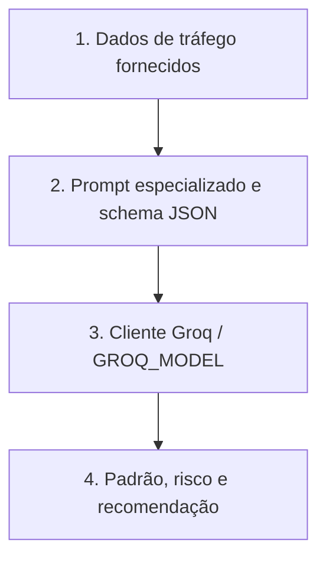

# Fluxo de Execução - Agente de Tráfego

```mermaid
flowchart TD
    A["1. Dados de tráfego fornecidos"]
    B["2. Prompt especializado e schema JSON"]
    C["3. Cliente Groq / GROQ_MODEL"]
    D["4. Padrão, risco e recomendação"]
    A --> B --> C --> D
```

O agente de tráfego é auxiliar. A coleta de NetFlow ou captura equivalente não é realizada pelo fluxo principal do `engine.py`.
