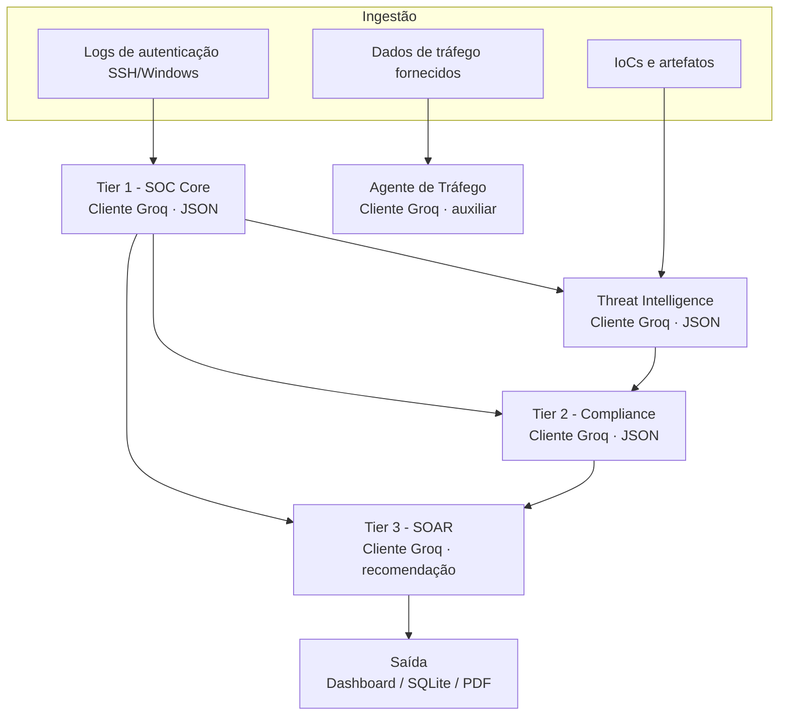

# Arquitetura Geral - Pipeline Multi-Agente (SOC)

## Leitura do fluxo

1. O `engine.py` coleta `journalctl -u ssh` via SSH verificado ou eventos Windows via WinRM.
2. O Tier 1 extrai IoCs e classifica o evento.
3. Threat Intelligence enriquece o IP/artefato identificado.
4. Compliance produz o enquadramento operacional LGPD/ISO.
5. SOAR gera uma recomendação de resposta.
6. Eventos confirmados são persistidos em SQLite e apresentados no painel Flask.

O comando do Tier 3 é uma recomendação. A execução automática, quando habilitada, é limitada às ações implementadas e deve seguir política operacional e allowlist.
