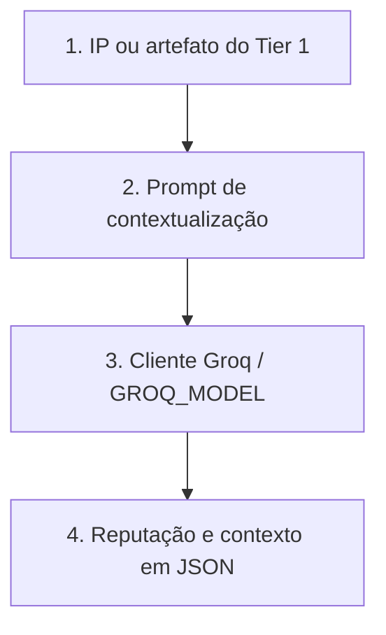

# Fluxo de Execução - Agente de Threat Intelligence

```mermaid
flowchart TD
    A["1. IP ou artefato do Tier 1"]
    B["2. Prompt de contextualização"]
    C["3. Cliente Groq / GROQ_MODEL"]
    D["4. Reputação e contexto em JSON"]
    A --> B --> C --> D
```

A resposta é um sinal analítico e deve ser confirmada em fontes confiáveis antes de decisões de alto impacto.
