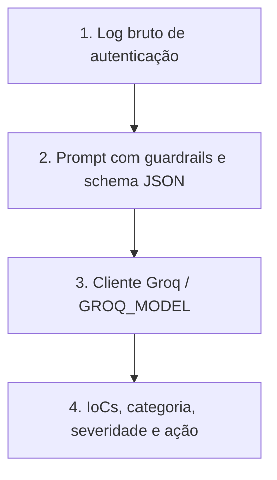

# Fluxo de Execução - Agente Tier 1 (SOC Core)

O Tier 1 é a primeira camada analítica. O resultado é consumido por Threat Intelligence, Compliance e SOAR. Temperatura e limite de saída são definidos pelo agente e pelo cliente compartilhado.
