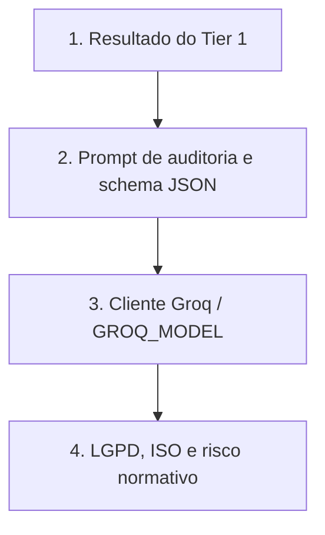

# Fluxo de Execução - Agente Tier 2 (Compliance)

```mermaid
flowchart TD
    A["1. Resultado do Tier 1"]
    B["2. Prompt de auditoria e schema JSON"]
    C["3. Cliente Groq / GROQ_MODEL"]
    D["4. LGPD, ISO e risco normativo"]
    A --> B --> C --> D
```

O resultado é uma avaliação operacional para apoiar a análise. Não constitui parecer jurídico nem certificação de conformidade.
