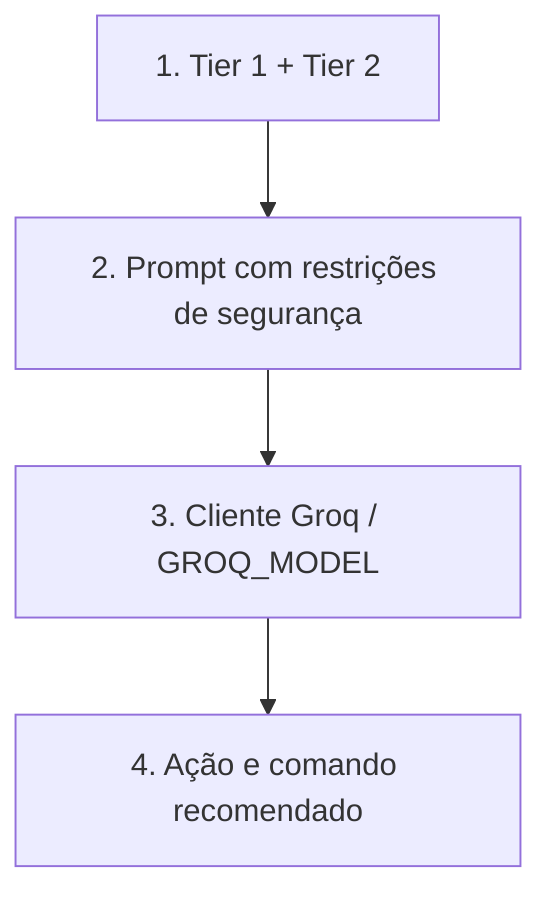

# Fluxo de Execução - Agente Tier 3 (SOAR)

O agente sugere ações de mitigação. A saída do LLM não é confiável por padrão; validação, allowlist e configuração de defesa são necessárias antes da execução.
